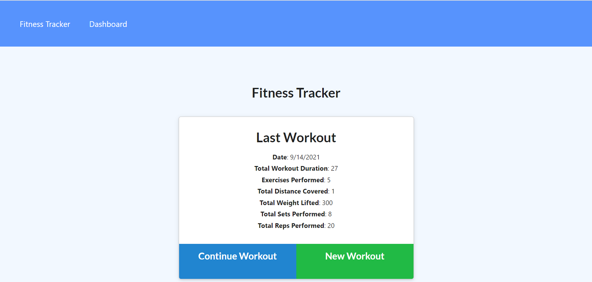
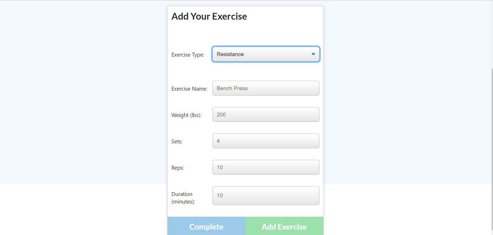
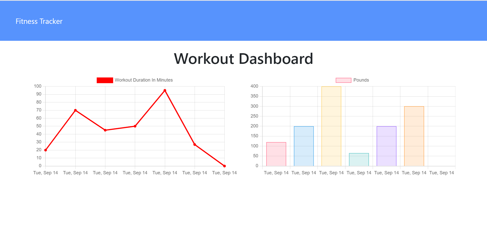

# Fitness Tracker
  

  Table of Contents |
  ----------------- |
  [Description](#description) |
  [Usage](#usage) |
  [License](#license) |
  [Contributions](#contributions) |
  [Questions](#questions) |

  ## Description
  This fitness tracking application allows users to keep track of their weekly workouts. Users can create or add to an existing workout, and can log exercises with customizable parameters. Users can see a summary of total weight lifted, total distance covered, and total time of each added workout. Users can see a summary of  workouts from the past week  on their dashboard with measurements of exercise length and amount of weight lifted. This app was built utilizing NodeJS, ExpressJS, Mongoose, and MongoDB and deployed with Heroku.

  ## Deployed Application

  https://secret-oasis-64981.herokuapp.com/?id=614160a099d8660016eb037c

  ## Usage
 The homepage shows your most recent workout and allows you to continue or create a new workout. 

 

 When you continue or create a new workout, you are given a form to enter in specific exercise data.

 

 Go to the dashboard to see a weekly summary of past workouts.

 

  ## License 
  This application is licensed under MIT open-source licensing.

  ## Contributions
  Contributors: Emily Tassoni

  If you wish to contribute, please contact the email below. You may fork this repository to use for testing purposes. Thank you!

  ## Questions
   Please contact [emilyjtassoni](mailto:emilyjtassoni) with questions. 
   Visit my [GitHub](https://github.com/tassoni13) to see past and current projects.
